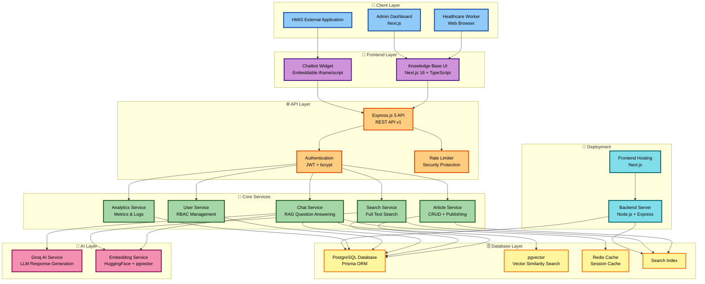
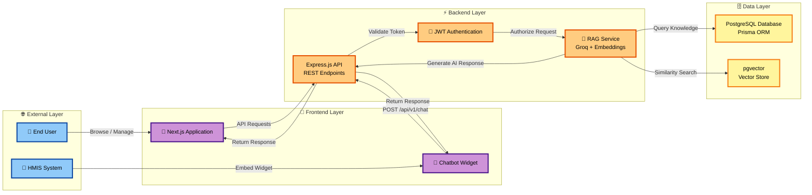
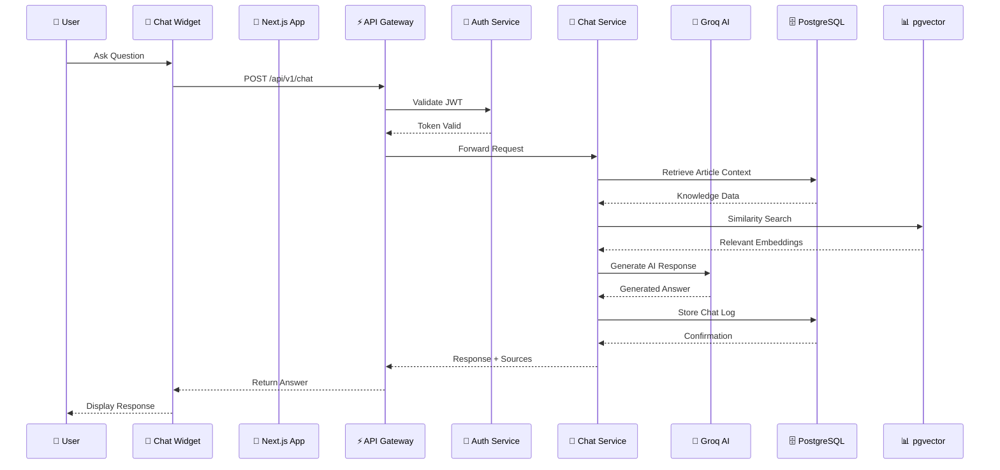
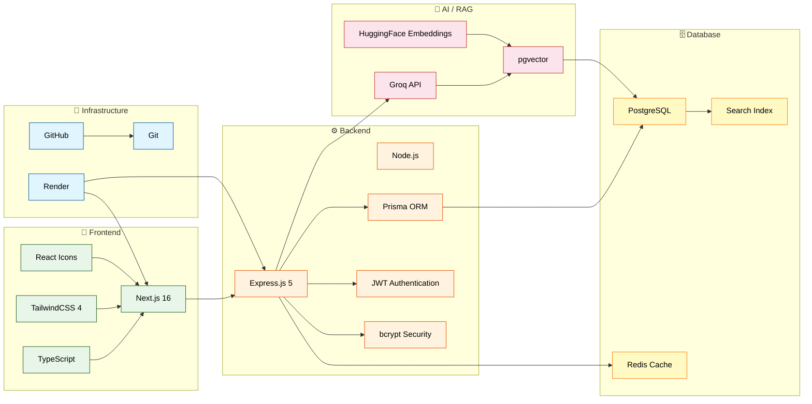

# 🏥 Healthcare Knowledge Base & HMIS Chatbot System

A production-ready **Healthcare Knowledge Base (KB) Platform** integrated with an **AI-powered HMIS Chatbot Assistant**.

The platform provides a centralized repository for:

- 📚 Healthcare documentation
- 📄 SOPs
- ❓ FAQs
- 🩺 Clinical workflows
- ⚙️ HMIS troubleshooting guides
- 🚀 Product release notes

Built for healthcare workers, system administrators, support teams, and new staff onboarding.

---

# 🚀 Capstone Project

## Healthcare Knowledge Base Platform for HMIS & Healthcare Products

This project focuses on designing and developing a secure knowledge management system with an embedded chatbot that enables users to quickly access verified healthcare information.

---

# ✨ Core Features

## 🔐 Authentication & RBAC

- JWT Authentication
- bcrypt password encryption
- Role-Based Access Control

Roles:

| Role      | Access                                    |
| --------- | ----------------------------------------- |
| 👤 Viewer | Read published articles                   |
| ✍️ Editor | Create and update articles                |
| 👑 Admin  | Publish articles, manage users, analytics |

---

## 📚 Knowledge Base Management

Implemented:

✅ Article CRUD operations  
✅ Draft & publishing workflow  
✅ Categories  
✅ Tags  
✅ Search engine  
✅ Feedback system  
✅ Analytics dashboard

Supported content:

- How-To Guides
- SOP Documents
- FAQs
- Troubleshooting Guides
- Feature References
- Release Notes

---

# 🤖 HMIS AI Chatbot Widget

The system includes an embeddable floating chatbot widget.

Flow:

```
User Question

      ↓

Chat Widget

      ↓

Backend API

      ↓

Knowledge Search

      ↓

AI Response

      ↓

Source Article
```

Features:

- 💬 Floating chat interface
- 🔎 Knowledge retrieval
- 🤖 AI powered answers
- 🔗 Article references
- 🌐 Cross-origin support

---

# 🛠 Technology Stack

# 🛠️ Tech Stack

## 🎨 Frontend


---

## ⚙️ Backend


---

## 🤖 AI / RAG Stack


---

## 🗄 Database


---

## 🚀 Deployment


---

# 🏗 System Architecture

## High-Level Architecture Overview

The HealthTech Knowledge Base AI Assistant follows a layered architecture design combining:

- Next.js frontend application
- Express.js REST API backend
- Secure authentication layer
- Knowledge management services
- AI-powered RAG chatbot pipeline
- PostgreSQL + pgvector storage
- Cloud deployment infrastructure

## Architecture Flow



---

# 🔄 System Flow

## End-to-End Request Flow

The HealthTech Knowledge Base AI Assistant follows this workflow:

1. User interacts with the Next.js application or HMIS chatbot widget
2. Frontend sends requests through REST API endpoints
3. Express.js validates authentication and authorization
4. RAG service retrieves relevant knowledge using embeddings
5. PostgreSQL + pgvector performs similarity search
6. AI service generates the final response
7. Response is returned back to the user



---

# 🔄 Component Communication Flow

## Chatbot Request Lifecycle

The following sequence demonstrates how the chatbot request moves across the application layers:

1. User submits a question through the chatbot widget
2. Request is sent to the Express API Gateway
3. Authentication middleware validates the JWT token
4. Chat service retrieves knowledge context
5. pgvector performs semantic similarity search
6. Groq AI generates the final response
7. Chat history and analytics are stored
8. Response is returned with sources



---

# 🔗 Technology Stack Integration

The system integrates frontend, backend, AI services, database infrastructure, and deployment services into a unified healthcare knowledge management platform.



---

# 📁 Project Structure

```
healthcare-kb-chatbot/


│
├── backend
│
│── config
│   └── database.js
│
│── controllers
│   ├── articleController.js
│   ├── authController.js
│   ├── chatController.js
│   └── searchController.js
│
│── middleware
│   ├── authMiddleware.js
│   ├── rateLimitMiddleware.js
│   └── roleMiddleware.js
│
│── prisma
│   ├── migrations
│   ├── schema.prisma
│   ├── seed.js
│   └── categorySeed.js
│
│── routes
│   ├── articleRoutes.js
│   ├── authRoutes.js
│   ├── chatRoutes.js
│   └── searchRoutes.js
│
│── services
│   ├── embeddingService.js
│   └── groqService.js
│
│── server.js
│── package.json
│── prisma.config.ts
│── .env


├── frontend


│── src/app

│   ├── analytics/page.tsx
│   ├── dashboard/page.tsx
│   ├── editor/page.tsx
│   ├── hmis/page.tsx
│   ├── login/page.tsx
│   ├── search/page.tsx
│   └── widget/page.tsx


│── components

│   ├── ArticleCard.tsx
│   ├── Navbar.tsx
│   ├── Sidebar.tsx
│   └── ChatWidget.tsx


│── hooks

│   └── useAuth.tsx


│── lib

│   └── api.ts


└── package.json

```

---

# 🗄 Database ERD


Entities:

- Users
- Articles
- Categories
- Tags
- Feedback
- Chat Logs
- Search Logs

---

# 🔌 API Documentation

[Download API Documentation PDF](docs/HealthTech%20Knowledge%20Base%20AI%20Assistant%20API%20Documentation.pdf)

## Authentication

```
POST /auth/login
```

## Articles

```
GET /articles

POST /articles

PUT /articles/:id

DELETE /articles/:id
```

## Search

```
GET /search?q=query
```

## Chatbot

```
POST /chat
```

---

# ⚙️ Backend Installation

```bash
cd backend

npm install
```

Create:

```
.env
```

Example:

```env
DATABASE_URL=

JWT_SECRET=

GROQ_API_KEY=

PORT=5000
```

Run database:

```bash
npx prisma migrate dev
```

Seed:

```bash
npm run seed
```

Start:

```bash
npm run dev
```

Backend:

```
http://localhost:5000
```

---

# 🎨 Frontend Installation

```bash
cd frontend

npm install
```

Create:

```
.env.local
```

Add:

```env
NEXT_PUBLIC_API_URL=http://localhost:5000
```

Run:

```bash
npm run dev
```

Frontend:

```
http://localhost:3000
```

---

# 🚀 Deployment (Render)

## Backend Deployment

Create Render Web Service:

Runtime:

```
Node
```

Build Command:

```bash
npm install
```

Start Command:

```bash
npm start
```

Environment Variables:

```
DATABASE_URL

JWT_SECRET

GROQ_API_KEY

PORT
```

---

## Frontend Deployment

Create Render Static Site:

Build:

```bash
npm run build
```

Environment:

```env
NEXT_PUBLIC_API_URL=https://your-backend.onrender.com
```

---

# 📸 Documentation Images

Store project images:

```
docs/

└── images

    ├── banner.png

    ├── system-architecture.png

    ├── erd.png

    ├── api-documentation.png

    └── screenshots/

```

---

# 🔒 Security

Implemented:

✅ JWT Authentication  
✅ bcrypt hashing  
✅ Helmet security headers  
✅ CORS protection  
✅ Rate limiting  
✅ Role authorization  
✅ Input validation

---

# 🧪 Testing

| Area        | Tool            |
| ----------- | --------------- |
| API         | Postman         |
| UI          | Browser Testing |
| Security    | Manual Testing  |
| Performance | Lighthouse      |

---

# 👨‍💻 Git Workflow

Branches:

```
main

development

feature/auth

feature/chatbot

feature/search
```

Commit style:

```
feat: add chatbot endpoint

fix: update auth middleware

docs: update README
```

---

# 📈 Future Improvements

- 🇰🇪 English / Swahili support
- 🎙 Voice assistant
- 📱 PWA offline mode
- 🧠 Advanced RAG pipeline
- 📜 Article version history
- 📧 Notification system

---

# 🎓 Capstone Deliverables

Completed:

✅ Requirements Document  
✅ Product Requirements Document  
✅ System Architecture  
✅ ERD Design  
✅ API Documentation  
✅ Backend REST API  
✅ Next.js Frontend  
✅ RBAC Security  
✅ AI Chatbot Widget  
✅ Render Deployment

---

# 📄 License

Healthcare IT Capstone Project.

Developed by:

**Abdisamad Abass Tawane**

```

```
