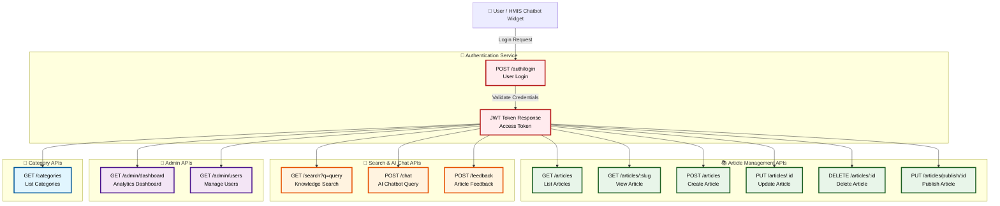

# 🔌 API Endpoint Flow

The Healthcare Knowledge Base system exposes RESTful APIs that allow the frontend application, HMIS chatbot widget, and administrators to communicate with the backend services.

The API layer is responsible for:

- User authentication using JWT tokens
- Secure access control through roles
- Knowledge base article management
- Search functionality
- AI chatbot communication
- User feedback collection
- Administrative analytics

## API Request Lifecycle

The request flow follows this process:

1. User or HMIS chatbot sends a request
2. Authentication endpoint validates user credentials
3. Backend returns JWT access token
4. Token is attached to protected API requests
5. Backend processes the request
6. Data is retrieved or stored in PostgreSQL database
7. Response is returned to the client

---
