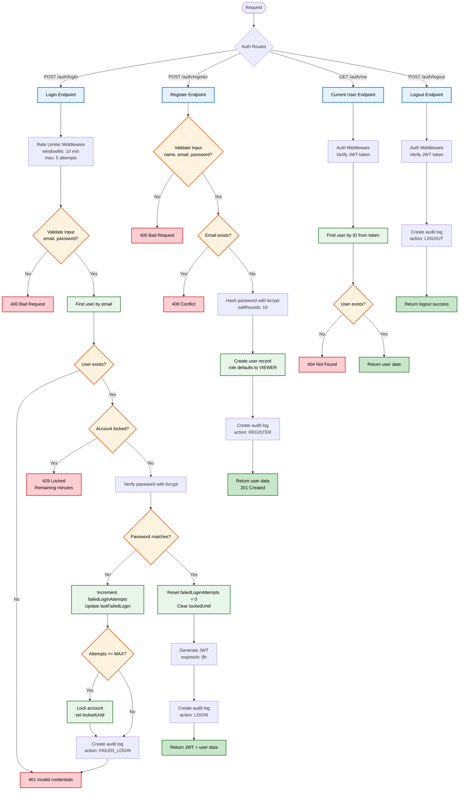

# 🔐 Authentication Controller Flowchart

## Overview

This flowchart illustrates the complete workflow of the **Authentication Controller** in the Healthcare Knowledge Base system. It covers user registration, login, authentication, current user retrieval, and logout operations.

The diagram demonstrates the security mechanisms implemented within the authentication process, including password hashing with **bcrypt**, JWT-based authentication, rate limiting, failed login tracking, temporary account locking, audit logging, and protected route verification. Together, these processes ensure secure user authentication and authorization while maintaining a complete audit trail of authentication activities.

---

## Flowchart

