# 🔍 Search Controller Flowchart

## Overview

This flowchart illustrates the complete workflow of the **Search Controller** in the Healthcare Knowledge Base system. It demonstrates how search requests are processed using a hybrid search strategy that combines **semantic vector search** with a **keyword search fallback** to maximize search accuracy and coverage.

The diagram also covers autocomplete, recent searches, trending searches, search analytics, search history management, zero-result query tracking, role-based content visibility, and error handling. Together, these processes provide an intelligent, analytics-driven search experience while supporting Retrieval-Augmented Generation (RAG) and continuous knowledge base improvement.

---

## Flowchart

```mermaid
flowchart TD
    Start([User Request]) --> Router{Search Routes}

    Router -->|GET /search| Search[search]
    Router -->|GET /search/auto-complete| Autocomplete[autocomplete]
    Router -->|GET /search/recent| RecentSearches[recentSearches]
    Router -->|GET /search/trending| Trending[trending]
    Router -->|GET /search/analytics| GetAnalytics[getAnalytics]
    Router -->|DELETE /search/history| ClearHistory[clearHistory]
    Router -->|GET /search/zero-results| GetZeroResults[getZeroResultQueries]

    %% SEARCH FLOW
    Search --> ValidateQuery{Query provided?}
    ValidateQuery -->|No| EmptyResult[Return empty results]
    ValidateQuery -->|Yes| SetPagination[Set pagination<br/>page, limit]

    SetPagination --> RoleCheck{Check User Role}

    RoleCheck -->|VIEWER| ViewerVisibility[Status = PUBLISHED only]
    RoleCheck -->|EDITOR| EditorVisibility[PUBLISHED OR<br/>own articles]
    RoleCheck -->|ADMIN| AdminVisibility[All articles]

    ViewerVisibility --> SemanticSearch
    EditorVisibility --> SemanticSearch
    AdminVisibility --> SemanticSearch

    %% SEMANTIC SEARCH
    SemanticSearch[Semantic Search] --> CreateEmbedding[Create embedding<br/>from query text]
    CreateEmbedding --> VectorSearch[Vector similarity search<br/>pgvector]

    VectorSearch --> ApplyFilters[Apply filters:<br/>category, type, product]
    ApplyFilters --> SortResults[Sort by:<br/>distance, avgRating, views, createdAt]
    SortResults --> LimitOffset[Apply OFFSET & LIMIT]
    LimitOffset --> CheckSemanticResults{Results found?}

    CheckSemanticResults -->|Yes| GetFullArticles[Fetch full article data<br/>with relations]
    GetFullArticles --> CalculateSimilarity[Calculate similarity score<br/>0-1 range]
    CalculateSimilarity --> LogSearch[Log search to SearchLog]
    LogSearch --> CheckZeroResults{Zero results?}
    CheckZeroResults -->|Yes| SaveUnanswered[Save to UnansweredQuestion]
    CheckZeroResults -->|No| ReturnSemantic[Return semantic results]

    SaveUnanswered --> ReturnSemantic

    CheckSemanticResults -->|No| KeywordSearch[Keyword Search Fallback]

    %% KEYWORD SEARCH FALLBACK
    KeywordSearch --> BuildKeywordFilters[Build filters<br/>category, type, product]
    BuildKeywordFilters --> KeywordConditions[Create OR conditions:<br/>title, content, tags, category, product]
    KeywordConditions --> ExecuteKeywordSearch[Execute keyword search]
    ExecuteKeywordSearch --> CountTotal[Get total count]
    CountTotal --> LogKeywordSearch[Log to SearchLog]
    LogKeywordSearch --> ReturnKeyword[Return keyword results]

    %% AUTOCOMPLETE FLOW
    Autocomplete --> ValidateAutocomplete{Query length >= 2?}
    ValidateAutocomplete -->|No| ReturnEmpty[Return empty array]
    ValidateAutocomplete -->|Yes| GetSuggestions[Get suggestions from:<br/>1. Article titles<br/>2. Tags<br/>3. Categories]
    GetSuggestions --> FormatSuggestions[Format with type labels<br/>and priority sorting]
    FormatSuggestions --> ReturnSuggestions[Return suggestions]

    %% RECENT SEARCHES FLOW
    RecentSearches --> GetRecent[Find recent searches<br/>by user ID]
    GetRecent --> DistinctByQuery[Distinct by query<br/>Order by createdAt desc<br/>Limit 20]
    DistinctByQuery --> ReturnRecent[Return recent searches]

    %% TRENDING SEARCHES FLOW
    Trending --> ParseDays[Parse days parameter<br/>Default: 7 days]
    ParseDays --> GroupByQuery[Group searches by query<br/>Count occurrences<br/>Where createdAt >= dateLimit]
    GroupByQuery --> OrderByCount[Order by count desc<br/>Limit 20]
    OrderByCount --> GetStats[Get additional stats<br/>lastResultCount, lastSearched]
    GetStats --> DetermineTrend[Determine trend<br/>rising > 5, stable]
    DetermineTrend --> ReturnTrending[Return trending searches]

    %% SEARCH ANALYTICS FLOW
    GetAnalytics --> ParseDaysAnalytics[Parse days parameter<br/>Default: 30 days]
    ParseDaysAnalytics --> GetOverallStats[Get overall stats:<br/>totalSearches, uniqueSearches, zeroResults]
    GetOverallStats --> GetDailyTrend[Get daily search counts<br/>SQL date grouping]
    GetDailyTrend --> GetPopularTerms[Get popular search terms<br/>Top 10 by count]
    GetPopularTerms --> ReturnAnalytics[Return analytics summary]

    %% CLEAR HISTORY FLOW
    ClearHistory --> DeleteUserHistory[Delete all SearchLog<br/>where userId matches]
    DeleteUserHistory --> ReturnClearMessage[Return success message]

    %% ZERO RESULTS QUERIES FLOW
    GetZeroResults --> ParseResolved[Parse resolved parameter]
    ParseResolved --> FindUnanswered[Find UnansweredQuestions<br/>where resolved = value]
    FindUnanswered --> OrderByDate[Order by askedAt desc<br/>Limit 50]
    OrderByDate --> ReturnUnanswered[Return unanswered queries]

    %% Error Handling
    Search --> SearchError{Error?}
    Autocomplete --> AutocompleteError{Error?}
    RecentSearches --> RecentError{Error?}
    Trending --> TrendingError{Error?}
    GetAnalytics --> AnalyticsError{Error?}
    ClearHistory --> ClearError{Error?}
    GetZeroResults --> ZeroError{Error?}

    SearchError -->|Yes| Error500[500 Internal Error]
    AutocompleteError -->|Yes| Error500
    RecentError -->|Yes| Error500
    TrendingError -->|Yes| Error500
    AnalyticsError -->|Yes| Error500
    ClearError -->|Yes| Error500
    ZeroError -->|Yes| Error500

    SearchError -->|No| SuccessResponse[200 Success]
    AutocompleteError -->|No| SuccessResponse
    RecentError -->|No| SuccessResponse
    TrendingError -->|No| SuccessResponse
    AnalyticsError -->|No| SuccessResponse
    ClearError -->|No| SuccessResponse
    ZeroError -->|No| SuccessResponse

    %% Styling (GitHub Friendly)
classDef process fill:#90caf9,stroke:#1565c0,stroke-width:2px,color:#000000
classDef decision fill:#ffcc80,stroke:#ef6c00,stroke-width:2px,color:#000000
classDef database fill:#a5d6a7,stroke:#2e7d32,stroke-width:2px,color:#000000
classDef semantic fill:#ce93d8,stroke:#6a1b9a,stroke-width:2px,color:#000000
classDef keyword fill:#f48fb1,stroke:#ad1457,stroke-width:2px,color:#000000
classDef error fill:#ef9a9a,stroke:#c62828,stroke-width:2px,color:#000000
classDef success fill:#81c784,stroke:#2e7d32,stroke-width:2px,color:#000000

    class Search,Autocomplete,RecentSearches,Trending,GetAnalytics,ClearHistory,GetZeroResults process
    class ValidateQuery,RoleCheck,CheckSemanticResults,CheckZeroResults,ValidateAutocomplete decision
    class CreateEmbedding,VectorSearch,ApplyFilters,SortResults,LimitOffset,GetFullArticles,CalculateSimilarity,LogSearch semantic
    class KeywordSearch,BuildKeywordFilters,KeywordConditions,ExecuteKeywordSearch,CountTotal,LogKeywordSearch keyword
    class Error500 error
    class SuccessResponse success
```

