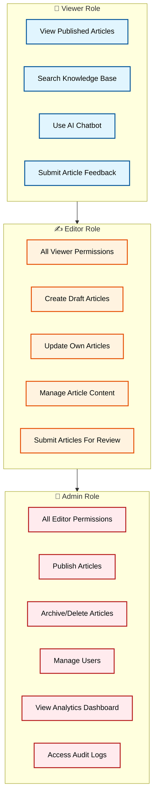

# 🔐 User Roles & Permissions

The Healthcare Knowledge Base system implements **Role-Based Access Control (RBAC)** to ensure users only access features allowed by their assigned role.

The system contains three main roles:

- Viewer
- Editor
- Admin

Permissions are enforced through JWT authentication and backend authorization middleware.

---
