# 📊 Analytics API Controller Flow

This diagram illustrates how analytics requests are routed through the Express.js backend, how each controller processes database queries using Prisma ORM, and how responses or errors are returned to the client. It documents the internal request lifecycle for the Analytics module and serves as a reference for developers maintaining or extending the analytics features.

```mermaid
flowchart TD
    Start([Client Request]) --> Router{Route Handler}

    Router -->|GET /analytics| GetAll[getAll]
    Router -->|GET /analytics/summary| GetSummary[getSummary]
    Router -->|GET /analytics/top-viewed| GetTopViewed[getTopViewed]
    Router -->|GET /analytics/most-searched| GetMostSearched[getMostSearched]
    Router -->|GET /analytics/low-rated| GetLowRated[getLowRated]
    Router -->|GET /analytics/popular-categories| GetPopularCategories[getPopularCategories]
    Router -->|GET /analytics/popular-modules| GetPopularModules[getPopularModules]
    Router -->|GET /analytics/assistant-usage| GetAssistantUsage[getAssistantUsage]
    Router -->|GET /analytics/feedback-trends| GetFeedbackTrends[getFeedbackTrends]
    Router -->|GET /analytics/unanswered| GetUnanswered[getUnanswered]
    Router -->|GET /analytics/search-trends| GetSearchTrends[getSearchTrends]
    Router -->|GET /analytics/:id| GetOne[getOne]

    %% GET SUMMARY FLOW
    GetSummary --> SummaryParallel[Parallel Promise.all]
    SummaryParallel --> CountTotal[Count Total Chats]
    SummaryParallel --> CountAnswered[Count Answered Questions]
    SummaryParallel --> CountUnanswered[Count Unanswered Questions]
    SummaryParallel --> AvgResponse[Average Response Time]
    SummaryParallel --> AvgConfidence[Average Confidence Score]
    SummaryParallel --> TotalArticles[Total Articles Retrieved]

    CountTotal --> SummaryResponse[Return Summary JSON]
    CountAnswered --> SummaryResponse
    CountUnanswered --> SummaryResponse
    AvgResponse --> SummaryResponse
    AvgConfidence --> SummaryResponse
    TotalArticles --> SummaryResponse

    %% GET ALL FLOW
    GetAll --> FindAll[Find All Chat Analytics<br/>Order by createdAt desc]
    FindAll --> AllResponse[Return All Analytics]

    %% GET ONE FLOW
    GetOne --> FindOne[Find Unique by ID]
    FindOne --> Exists{Exists?}
    Exists -->|No| NotFound[404 Not Found]
    Exists -->|Yes| OneResponse[Return Analytics]

    %% TOP VIEWED FLOW
    GetTopViewed --> TopViewedQuery[Find Published Articles<br/>Select: id, title, views, avgRating, reviewCount<br/>Order by views desc<br/>Limit 10]
    TopViewedQuery --> TopViewedResponse[Return Top Viewed Articles]

    %% MOST SEARCHED FLOW
    GetMostSearched --> MostSearchedQuery[Group SearchLog by query<br/>Count occurrences<br/>Order by count desc<br/>Limit 10]
    MostSearchedQuery --> MostSearchedResponse[Return Most Searched Queries]

    %% LOW RATED FLOW
    GetLowRated --> LowRatedQuery[Find Articles with reviewCount > 0<br/>Select: id, title, avgRating, reviewCount<br/>Order by avgRating asc<br/>Limit 10]
    LowRatedQuery --> LowRatedResponse[Return Lowest Rated Articles]

    %% POPULAR CATEGORIES FLOW
    GetPopularCategories --> PopularCategoriesQuery[Find All Categories<br/>Select: id, name, article count<br/>Order by article count desc]
    PopularCategoriesQuery --> PopularCategoriesResponse[Return Categories with Counts]

    %% POPULAR MODULES FLOW
    GetPopularModules --> PopularModulesQuery[Group Articles by product<br/>Count occurrences<br/>Order by count desc]
    PopularModulesQuery --> PopularModulesResponse[Return Product Module Counts]

    %% ASSISTANT USAGE FLOW
    GetAssistantUsage --> AssistantUsageQuery[Group ChatAnalytics by model<br/>Count total<br/>Average responseTime<br/>Average confidence]
    AssistantUsageQuery --> AssistantUsageResponse[Return Model Usage Stats]

    %% FEEDBACK TRENDS FLOW
    GetFeedbackTrends --> FeedbackTrendsQuery[Group Feedback by rating<br/>Count occurrences<br/>Order by rating asc]
    FeedbackTrendsQuery --> FeedbackTrendsResponse[Return Rating Distribution]

    %% UNANSWERED FLOW
    GetUnanswered --> UnansweredQuery[Find Unanswered Questions<br/>Where resolved = false<br/>Order by askedAt desc<br/>Limit 50]
    UnansweredQuery --> UnansweredResponse[Return Unanswered Questions]

    %% SEARCH TRENDS FLOW
    GetSearchTrends --> SearchTrendsQuery[Raw SQL Query:<br/>Group SearchLog by date<br/>Count searches per day<br/>Limit 30 days<br/>Order by date desc]
    SearchTrendsQuery --> SearchTrendsResponse[Return Daily Search Trends]

    %% Error Handling
    GetSummary --> ErrorHandler1{Error?}
    GetAll --> ErrorHandler2{Error?}
    GetOne --> ErrorHandler3{Error?}
    GetTopViewed --> ErrorHandler4{Error?}
    GetMostSearched --> ErrorHandler5{Error?}
    GetLowRated --> ErrorHandler6{Error?}
    GetPopularCategories --> ErrorHandler7{Error?}
    GetPopularModules --> ErrorHandler8{Error?}
    GetAssistantUsage --> ErrorHandler9{Error?}
    GetFeedbackTrends --> ErrorHandler10{Error?}
    GetUnanswered --> ErrorHandler11{Error?}
    GetSearchTrends --> ErrorHandler12{Error?}

    ErrorHandler1 -->|Yes| ErrorResponse1[500 Error Response]
    ErrorHandler2 -->|Yes| ErrorResponse2[500 Error Response]
    ErrorHandler3 -->|Yes| ErrorResponse3[500 Error Response]
    ErrorHandler4 -->|Yes| ErrorResponse4[500 Error Response]
    ErrorHandler5 -->|Yes| ErrorResponse5[500 Error Response]
    ErrorHandler6 -->|Yes| ErrorResponse6[500 Error Response]
    ErrorHandler7 -->|Yes| ErrorResponse7[500 Error Response]
    ErrorHandler8 -->|Yes| ErrorResponse8[500 Error Response]
    ErrorHandler9 -->|Yes| ErrorResponse9[500 Error Response]
    ErrorHandler10 -->|Yes| ErrorResponse10[500 Error Response]
    ErrorHandler11 -->|Yes| ErrorResponse11[500 Error Response]
    ErrorHandler12 -->|Yes| ErrorResponse12[500 Error Response]

    ErrorHandler1 -->|No| SuccessResponse1[200 Success]
    ErrorHandler2 -->|No| SuccessResponse2[200 Success]
    ErrorHandler3 -->|No| SuccessResponse3[200 Success]
    ErrorHandler4 -->|No| SuccessResponse4[200 Success]
    ErrorHandler5 -->|No| SuccessResponse5[200 Success]
    ErrorHandler6 -->|No| SuccessResponse6[200 Success]
    ErrorHandler7 -->|No| SuccessResponse7[200 Success]
    ErrorHandler8 -->|No| SuccessResponse8[200 Success]
    ErrorHandler9 -->|No| SuccessResponse9[200 Success]
    ErrorHandler10 -->|No| SuccessResponse10[200 Success]
    ErrorHandler11 -->|No| SuccessResponse11[200 Success]
    ErrorHandler12 -->|No| SuccessResponse12[200 Success]

    %% Styling
    classDef process fill:#e3f2fd,stroke:#1565c0,stroke-width:2px
    classDef query fill:#e8f5e9,stroke:#2e7d32,stroke-width:2px
    classDef response fill:#f3e5f5,stroke:#6a1b9a,stroke-width:2px
    classDef error fill:#ffcdd2,stroke:#c62828,stroke-width:2px
    classDef success fill:#c8e6c9,stroke:#2e7d32,stroke-width:2px
    classDef router fill:#fff3e0,stroke:#e65100,stroke-width:2px
    classDef parallel fill:#fce4ec,stroke:#880e4f,stroke-width:2px

    class GetSummary,GetAll,GetOne,GetTopViewed,GetMostSearched,GetLowRated,GetPopularCategories,GetPopularModules,GetAssistantUsage,GetFeedbackTrends,GetUnanswered,GetSearchTrends process
    class SummaryParallel parallel
    class CountTotal,CountAnswered,CountUnanswered,AvgResponse,AvgConfidence,TotalArticles,FindAll,FindOne,TopViewedQuery,MostSearchedQuery,LowRatedQuery,PopularCategoriesQuery,PopularModulesQuery,AssistantUsageQuery,FeedbackTrendsQuery,UnansweredQuery,SearchTrendsQuery query
    class SummaryResponse,AllResponse,OneResponse,TopViewedResponse,MostSearchedResponse,LowRatedResponse,PopularCategoriesResponse,PopularModulesResponse,AssistantUsageResponse,FeedbackTrendsResponse,UnansweredResponse,SearchTrendsResponse response
    class NotFound,ErrorResponse1,ErrorResponse2,ErrorResponse3,ErrorResponse4,ErrorResponse5,ErrorResponse6,ErrorResponse7,ErrorResponse8,ErrorResponse9,ErrorResponse10,ErrorResponse11,ErrorResponse12 error
    class SuccessResponse1,SuccessResponse2,SuccessResponse3,SuccessResponse4,SuccessResponse5,SuccessResponse6,SuccessResponse7,SuccessResponse8,SuccessResponse9,SuccessResponse10,SuccessResponse11,SuccessResponse12 success
    class Router router
```

---
