# 📝 Article Management System Flow

The Healthcare Knowledge Base implements a structured content management workflow that ensures every article is created, reviewed, approved, and published according to Role-Based Access Control (RBAC) policies.

The workflow defines how Viewers, Editors, and Administrators interact with articles while enforcing authentication, authorization, article versioning, review assignments, publishing rules, archiving, and soft deletion.

The following diagram illustrates the complete article lifecycle from creation through publication and maintenance.

```mermaid
flowchart TD
    Start([Start]) --> Auth{Authentication}
    Auth -->|Unauthorized| End401[401 Unauthorized]
    Auth -->|Authorized| CheckRole{Check User Role}

    CheckRole -->|VIEWER| ViewerFlow[VIEWER Access]
    CheckRole -->|EDITOR| EditorFlow[EDITOR Access]
    CheckRole -->|ADMIN| AdminFlow[ADMIN Access]

    %% VIEWER FLOW
    ViewerFlow --> ViewAllArticles[GET /articles<br/>View all published articles]
    ViewerFlow --> ViewArticle[GET /articles/:id<br/>View published article only]
    ViewerFlow --> AddFeedback[POST /articles/:id/feedback<br/>Add feedback to published articles]

    %% EDITOR FLOW
    EditorFlow --> EditorActions{Editor Actions}
    EditorActions -->|Create| CreateArticle[POST /articles<br/>Create new draft article]
    EditorActions -->|Update| UpdateArticle[PUT /articles/:id<br/>Update own draft/in-review article]
    EditorActions -->|Submit| SubmitArticle[PUT /articles/:id/submit<br/>Submit draft for review]
    EditorActions -->|View| ViewEditorArticles[View own & published articles]

    %% ADMIN FLOW
    AdminFlow --> AdminActions{Admin Actions}

    %% Create Sub-flow
    AdminActions -->|Create| AdminCreate[POST /articles<br/>Create article]
    AdminCreate --> AdminCreateProcess[Process: Generate slug,<br/>Generate embedding,<br/>Save article & vector]
    AdminCreateProcess --> AdminCreateSuccess[Article Created]

    %% Update Sub-flow
    AdminActions -->|Update| AdminUpdate[PUT /articles/:id<br/>Update any article]
    AdminUpdate --> AdminUpdateProcess[Process: Check status,<br/>Save version,<br/>Update embedding]
    AdminUpdateProcess --> AdminUpdateSuccess[Article Updated]

    %% Submit Sub-flow
    AdminActions -->|Submit| AdminSubmit[PUT /articles/:id/submit]
    AdminSubmit --> AdminSubmitProcess[Check: DRAFT status only,<br/>Set status to SUBMITTED,<br/>Log review]
    AdminSubmitProcess --> AdminSubmitSuccess[Article Submitted]

    %% Review Sub-flow
    AdminActions -->|Review| AdminReview[PUT /articles/:id/review]
    AdminReview --> AdminReviewProcess[Check: SUBMITTED status,<br/>Not author,<br/>Not already reviewed,<br/>Set status to IN_REVIEW,<br/>Assign reviewer]
    AdminReviewProcess --> AdminReviewSuccess[Review Started]

    %% Approve Sub-flow
    AdminActions -->|Approve| AdminApprove[PUT /articles/:id/approve]
    AdminApprove --> AdminApproveProcess[Check: IN_REVIEW status,<br/>Assigned reviewer,<br/>Set status to APPROVED,<br/>Set approvedAt]
    AdminApproveProcess --> AdminApproveSuccess[Article Approved]

    %% Reject Sub-flow
    AdminActions -->|Reject| AdminReject[PUT /articles/:id/reject]
    AdminReject --> AdminRejectProcess[Check: IN_REVIEW status,<br/>Assigned reviewer,<br/>Requires comments,<br/>Set status to REJECTED]
    AdminRejectProcess --> AdminRejectSuccess[Article Rejected]

    %% Publish Sub-flow
    AdminActions -->|Publish| AdminPublish[PUT /articles/:id/publish]
    AdminPublish --> AdminPublishProcess[Check: APPROVED status,<br/>Same reviewer,<br/>Set status to PUBLISHED,<br/>Set publishedAt]
    AdminPublishProcess --> AdminPublishSuccess[Article Published]

    %% Archive Sub-flow
    AdminActions -->|Archive| AdminArchive[PUT /articles/:id/archive]
    AdminArchive --> AdminArchiveProcess[Check: PUBLISHED status,<br/>Set lastStatus,<br/>Set status to ARCHIVED,<br/>Set archivedAt]
    AdminArchiveProcess --> AdminArchiveSuccess[Article Archived]

    %% Restore Sub-flow
    AdminActions -->|Restore| AdminRestore[PUT /articles/:id/restore]
    AdminRestore --> AdminRestoreProcess[Check: ARCHIVED status,<br/>Valid lastStatus,<br/>Restore to previous status]
    AdminRestoreProcess --> AdminRestoreSuccess[Article Restored]

    %% Delete Sub-flow
    AdminActions -->|Delete| AdminDelete[DELETE /articles/:id]
    AdminDelete --> AdminDeleteProcess[Check: Not PUBLISHED,<br/>Soft delete,<br/>Remove embedding,<br/>Set status to DELETED]
    AdminDeleteProcess --> AdminDeleteSuccess[Article Deleted]

    %% History
    AdminActions -->|View History| ViewHistory[GET /articles/:id/history<br/>View review history]

    %% Feedback
    AdminActions -->|Feedback| AdminFeedback[POST /articles/:id/feedback<br/>Add feedback]

    %% Common Actions
    AdminActions -->|View All| AdminViewAll[GET /articles<br/>View all articles with filters]
    AdminActions -->|View Single| AdminViewSingle[GET /articles/:id<br/>View any article]

    %% Workflow Status Diagram
    subgraph Workflow[Article Workflow Status Flow]
        direction LR
        Draft[DRAFT] -->|submit| Submitted[SUBMITTED]
        Submitted -->|review| InReview[IN_REVIEW]
        InReview -->|approve| Approved[APPROVED]
        InReview -->|reject| Rejected[REJECTED]
        Approved -->|publish| Published[PUBLISHED]
        Published -->|archive| Archived[ARCHIVED]
        Archived -->|restore| Published
        Published -->|admin delete| Deleted[DELETED]
        Draft -->|edit| Draft
        InReview -->|edit| InReview
        Rejected -->|edit| Draft
    end

    %% Styling
    classDef viewer fill:#e1f5fe,stroke:#01579b
    classDef editor fill:#f3e5f5,stroke:#4a148c
    classDef admin fill:#fff3e0,stroke:#e65100
    classDef process fill:#e8f5e9,stroke:#1b5e20
    classDef success fill:#c8e6c9,stroke:#2e7d32
    classDef error fill:#ffcdd2,stroke:#c62828

    class ViewerFlow,ViewAllArticles,ViewArticle,AddFeedback viewer
    class EditorFlow,CreateArticle,UpdateArticle,SubmitArticle,ViewEditorArticles editor
    class AdminActions,AdminCreate,AdminUpdate,AdminSubmit,AdminReview,AdminApprove,AdminReject,AdminPublish,AdminArchive,AdminRestore,AdminDelete,ViewHistory,AdminFeedback,AdminViewAll,AdminViewSingle admin
    class AdminCreateProcess,AdminUpdateProcess,AdminSubmitProcess,AdminReviewProcess,AdminApproveProcess,AdminRejectProcess,AdminPublishProcess,AdminArchiveProcess,AdminRestoreProcess,AdminDeleteProcess process
    class AdminCreateSuccess,AdminUpdateSuccess,AdminSubmitSuccess,AdminReviewSuccess,AdminApproveSuccess,AdminPublishSuccess,AdminArchiveSuccess,AdminRestoreSuccess,AdminDeleteSuccess success
    class End401 error

```

---
