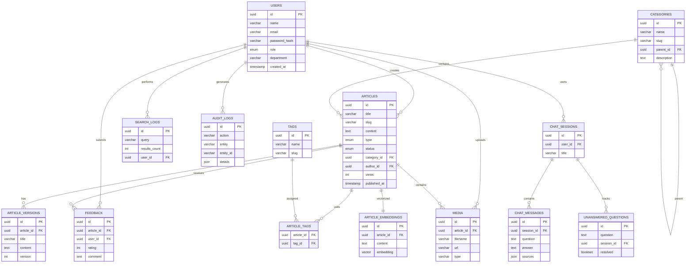

# 🗄 Database Schema

The Healthcare Knowledge Base system uses a relational PostgreSQL database managed through Prisma ORM.

The schema supports:

- User authentication and RBAC
- Article management
- Version control
- Categories and tags
- Search analytics
- Chatbot conversations
- AI embeddings with pgvector
- Audit tracking

---
