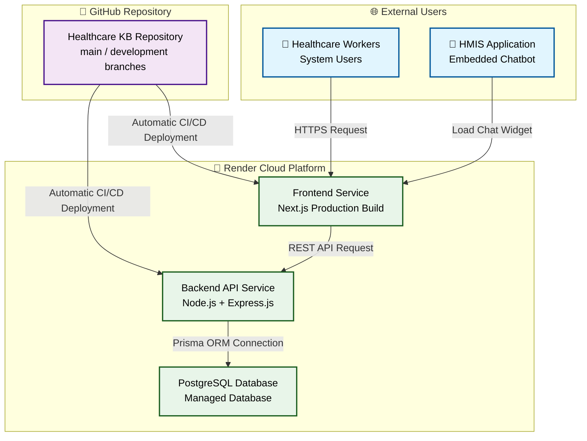

# 🚀 Deployment Architecture

The Healthcare Knowledge Base & HMIS Chatbot system uses a cloud-based deployment architecture.

The application is deployed using:

- **GitHub** for source code management and CI/CD workflow
- **Render** for hosting frontend, backend API, and PostgreSQL database
- **Next.js** frontend application
- **Node.js + Express.js** backend API
- **PostgreSQL** managed database

Deployment workflow:

1. Developers push code changes to GitHub repository
2. Render automatically builds and deploys updated services
3. Frontend communicates with backend through REST API
4. Backend connects securely to PostgreSQL database
5. HMIS applications embed the chatbot widget from the frontend

---
