# 👥 User Controller Flowchart

## Overview

This flowchart illustrates the complete workflow of the **User Controller** in the Healthcare Knowledge Base system. It covers all user management operations, including user creation, retrieval, updating, role assignment, activation, deactivation, deletion, and audit log retrieval.

The diagram also demonstrates the validation process, password hashing, audit logging, database interactions, error handling, and HTTP responses returned by each endpoint. It provides a comprehensive overview of how the system enforces secure and traceable user administration through Role-Based Access Control (RBAC).

---

## Flowchart

```mermaid
flowchart TD
    Start([Admin Request]) --> Router{User Routes}

    Router -->|GET /users| GetAllUsers[getAllUsers]
    Router -->|GET /users/:id| GetUserById[getUserById]
    Router -->|POST /users| CreateUser[createUser]
    Router -->|PUT /users/:id| UpdateUser[updateUser]
    Router -->|PUT /users/:id/role| AssignRole[assignRole]
    Router -->|PUT /users/:id/deactivate| DeactivateUser[deactivateUser]
    Router -->|PUT /users/:id/activate| ActivateUser[activateUser]
    Router -->|DELETE /users/:id| DeleteUser[deleteUser]
    Router -->|GET /users/audit/logs| GetAuditLogs[getAuditLogs]

    %% GET ALL USERS
    GetAllUsers --> FindAllUsers[Find All Users]
    FindAllUsers --> SelectFields[Select: id, name, email, role,<br/>department, isActive, createdAt, updatedAt,<br/>_count: articles, feedbacks]
    SelectFields --> OrderBy[Order by createdAt desc]
    OrderBy --> ReturnUsers[Return Users JSON]

    %% GET USER BY ID
    GetUserById --> FindUser[Find User by ID]
    FindUser --> UserExists{User Exists?}
    UserExists -->|No| NotFound404[404 Not Found]
    UserExists -->|Yes| SelectUserFields[Select: id, name, email, role,<br/>department, isActive, createdAt, updatedAt,<br/>articles: id, title, status, createdAt]
    SelectUserFields --> ReturnUser[Return User JSON]

    %% CREATE USER
    CreateUser --> ValidateCreate{Validate Input}
    ValidateCreate --> CheckEmailExists{Email already exists?}
    CheckEmailExists -->|Yes| Conflict409[409 Conflict]
    CheckEmailExists -->|No| HashPassword[Hash Password with bcrypt<br/>saltRounds: 10]
    HashPassword --> CreateUserRecord[Create User Record<br/>role defaults to VIEWER]
    CreateUserRecord --> CreateAuditCreate[Create Audit Log<br/>action: CREATE, entity: User]
    CreateAuditCreate --> ReturnCreated[201 Created]

    %% UPDATE USER
    UpdateUser --> FindUserUpdate[Find User by ID]
    FindUserUpdate --> UpdateUserRecord[Update User<br/>fields: name, email, department]
    UpdateUserRecord --> CreateAuditUpdate[Create Audit Log<br/>action: UPDATE, entity: User]
    CreateAuditUpdate --> ReturnUpdated[200 Updated]

    %% ASSIGN ROLE
    AssignRole --> ValidateRole{Validate Role<br/>VIEWER/EDITOR/ADMIN}
    ValidateRole --> UpdateUserRole[Update User Role]
    UpdateUserRole --> CreateAuditRole[Create Audit Log<br/>action: ASSIGN_ROLE,<br/>details: role]
    CreateAuditRole --> ReturnRole[Role Updated]

    %% DEACTIVATE USER
    DeactivateUser --> FindUserDeactivate[Find User by ID]
    FindUserDeactivate --> UpdateDeactivate[Update isActive = false]
    UpdateDeactivate --> CreateAuditDeactivate[Create Audit Log<br/>action: DEACTIVATE]
    CreateAuditDeactivate --> ReturnDeactivated[User Deactivated]

    %% ACTIVATE USER
    ActivateUser --> FindUserActivate[Find User by ID]
    FindUserActivate --> UpdateActivate[Update isActive = true]
    UpdateActivate --> CreateAuditActivate[Create Audit Log<br/>action: ACTIVATE]
    CreateAuditActivate --> ReturnActivated[User Activated]

    %% DELETE USER
    DeleteUser --> FindUserDelete[Find User by ID]
    FindUserDelete --> DeleteUserRecord[Delete User from Database]
    DeleteUserRecord --> CreateAuditDelete[Create Audit Log<br/>action: DELETE]
    CreateAuditDelete --> ReturnDeleted[User Deleted]

    %% AUDIT LOGS
    GetAuditLogs --> FindAuditLogs[Find All Audit Logs]
    FindAuditLogs --> IncludeUser[Include User relation<br/>id, name, email, role]
    IncludeUser --> OrderByAudit[Order by createdAt desc]
    OrderByAudit --> ReturnAudit[Return Audit Logs JSON]

    %% Error Handling
    GetAllUsers --> Error1{Error?}
    GetUserById --> Error2{Error?}
    CreateUser --> Error3{Error?}
    UpdateUser --> Error4{Error?}
    AssignRole --> Error5{Error?}
    DeactivateUser --> Error6{Error?}
    ActivateUser --> Error7{Error?}
    DeleteUser --> Error8{Error?}
    GetAuditLogs --> Error9{Error?}

    Error1 -->|Yes| Error500[500 Error]
    Error2 -->|Yes| Error500
    Error3 -->|Yes| Error500
    Error4 -->|Yes| Error500
    Error5 -->|Yes| Error500
    Error6 -->|Yes| Error500
    Error7 -->|Yes| Error500
    Error8 -->|Yes| Error500
    Error9 -->|Yes| Error500

    Error1 -->|No| Success[200 Success]
    Error2 -->|No| Success
    Error3 -->|No| Created[201 Created]
    Error4 -->|No| Success
    Error5 -->|No| Success
    Error6 -->|No| Success
    Error7 -->|No| Success
    Error8 -->|No| Success
    Error9 -->|No| Success

    %% Styling
classDef process fill:#e3f2fd,stroke:#1565c0,stroke-width:2px,color:#000000
classDef decision fill:#fff3e0,stroke:#e65100,stroke-width:2px,color:#000000
classDef database fill:#e8f5e9,stroke:#2e7d32,stroke-width:2px,color:#000000
classDef error fill:#ffcdd2,stroke:#c62828,stroke-width:2px,color:#000000
classDef success fill:#c8e6c9,stroke:#2e7d32,stroke-width:2px,color:#000000
classDef audit fill:#f3e5f5,stroke:#6a1b9a,stroke-width:2px,color:#000000

    class GetAllUsers,GetUserById,CreateUser,UpdateUser,AssignRole,DeactivateUser,ActivateUser,DeleteUser,GetAuditLogs process
    class ValidateCreate,CheckEmailExists,UserExists,ValidateRole decision
    class FindAllUsers,SelectFields,OrderBy,FindUser,HashPassword,CreateUserRecord,FindUserUpdate,UpdateUserRecord,FindUserDeactivate,UpdateDeactivate,FindUserActivate,UpdateActivate,FindUserDelete,DeleteUserRecord,FindAuditLogs,IncludeUser,OrderByAudit database
    class CreateAuditCreate,CreateAuditUpdate,CreateAuditRole,CreateAuditDeactivate,CreateAuditActivate,CreateAuditDelete audit
    class NotFound404,Conflict409,Error500 error
    class ReturnUsers,ReturnUser,ReturnCreated,ReturnUpdated,ReturnRole,ReturnDeactivated,ReturnActivated,ReturnDeleted,ReturnAudit,Success,Created success
```

---
